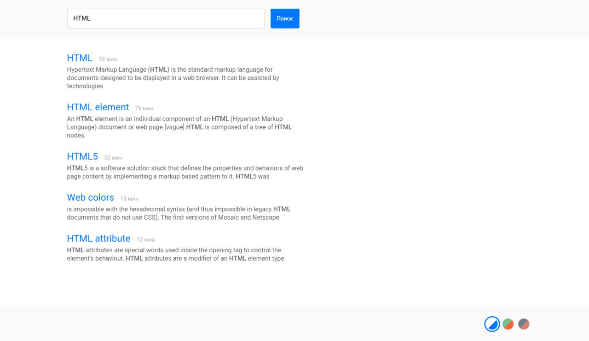

# Тестовое задание для NAUMEN

[Проект на StackBlitz ⚡️](https://stackblitz.com/edit/angular-dbgnjy)

## Работа с проектом:

В верхней части сайта в текстовое поле вводим небоходимый запрос и нажимаем на кнопку "Поиск"

У каждой статьи рядом с заголовком указано среднее время чтения 

В нижней части сайта можно поменять тему оформления

## Что было сделано:

 Компонент header-search имеет метод search(), который получает список статей, после чего пользователь их види.

 После каждого успешного поиска (усаешный - поиск, который отдал одну статью или более) запрос сохраняется в массив для дальнейшего использования в качестве подсказки.

## Что не было сделано:

В связи с малым опытом в angular и ngrx не была реализована пагинация и фильтрация статей.

Предполагалось использовать state-less компоненты, а все данные (статьи, номер страницы, фильтр, запрос) хранить в store и обращаться к ним через глобальные методы, которые были бы доступны для всех компонентов.
